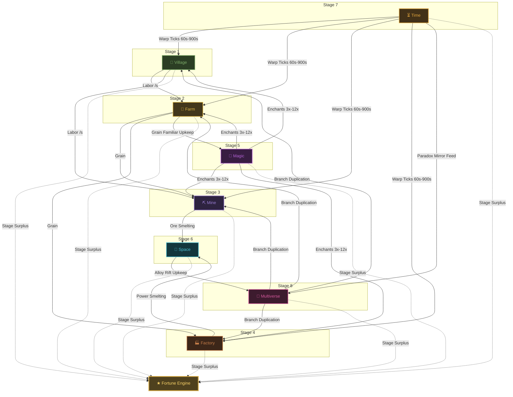
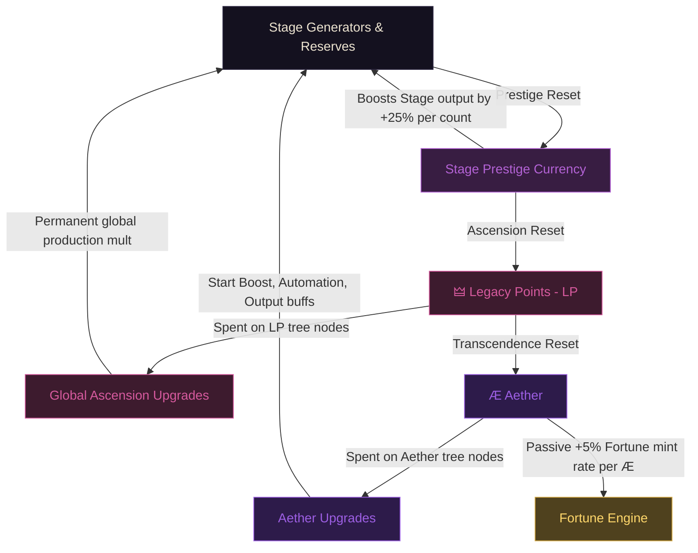

# Architecture Diagrams — Cog & Cosmos

This document contains visual Mermaid diagrams detailing the architecture, cross-stage interdependencies, prestige hierarchies, and data pipelines of the **Cog & Cosmos** Fortune Engine.

---

## 1. The Compounding Stage Synergy Loop

Each of the eight stages feeds into the next, forming a highly compounding network where bottlenecks in earlier stages directly starve later stages, and buffs from later stages duplicate or speed up earlier production.



---

## 2. Prestige Hierarchy

The game features three separate prestige resets, moving from local stage cycles to global meta upgrades.



---

## 3. Simulation Loop & Save Data Pipeline

The central game store runs a strict decoupled simulation clock and serializes progress using base64 compression.

```mermaid
sequenceDiagram
    autonumber
    participant Loop as Fixed 20Hz Sim Loop
    participant Store as game.svelte.ts (Reactive Store)
    participant LZ as LZ-String Compressor
    participant IDB as IndexedDB (Browser Storage)

    Loop->>Store: stepSim(0.05 seconds)
    Note over Store: 1. Tick Stage Economies<br/>2. Fire Auto-buyers<br/>3. Re-calculate Space/Time/Multiverse<br/>4. Mint ★ Fortune
    Store->>Store: checkUnlocks()
    
    Note over Store: Every 30s: Trigger Auto-save
    Store->>Store: JSON.stringify(gs, replacer)
    Note over Store: Converts Decimals to string representations
    Store->>LZ: Compress UTF16/Base64
    LZ-->>Store: Compressed string
    Store->>IDB: set("cog_cosmos_save", data)
    IDB-->>Store: Success confirmation
```
